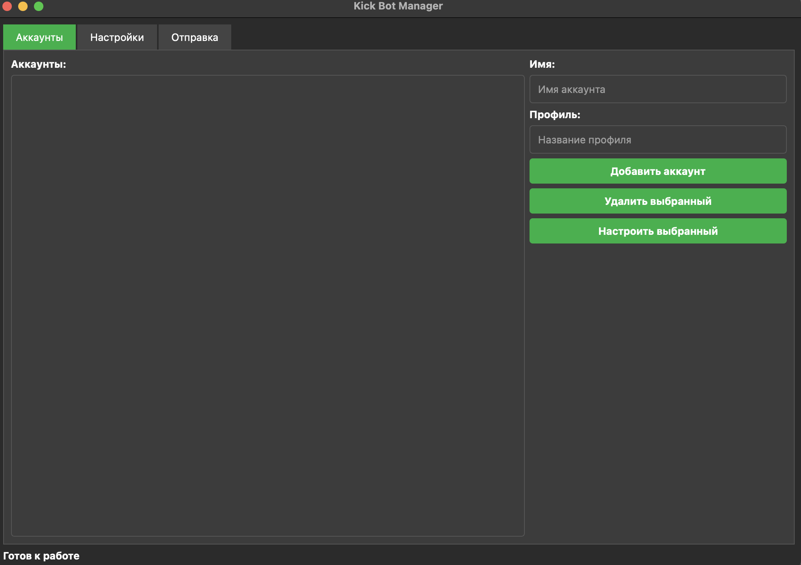
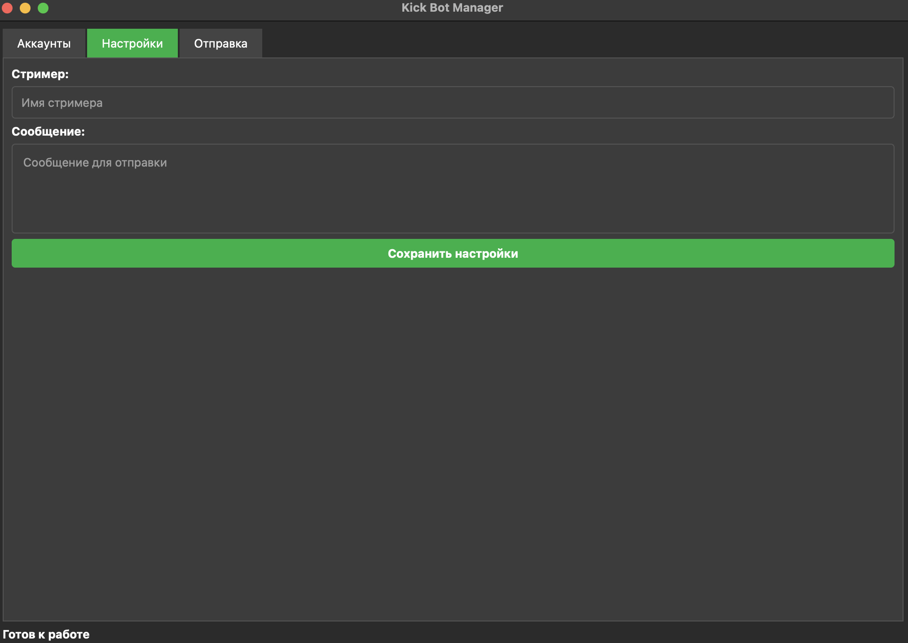
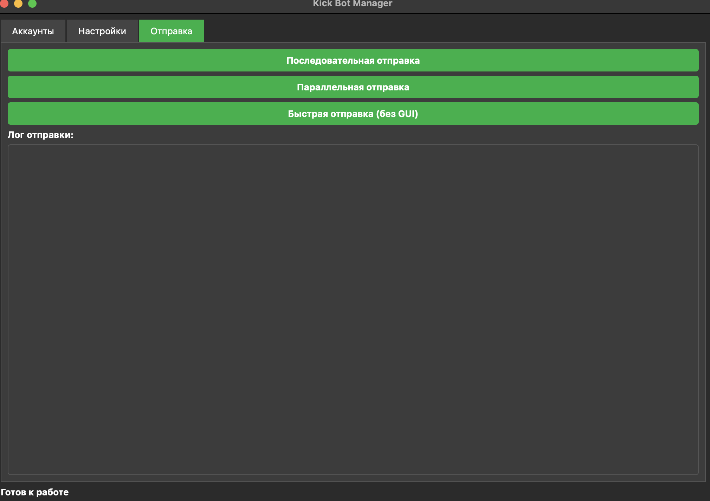

# 🤖 Kick.com Spam Bot (BETA)

Мощный и эффективный бот для автоматизации взаимодействия с чатом Kick.com. Поддержка многопоточной работы с несколькими аккаунтами одновременно.

##

- 🚀 **Многопоточная отправка** сообщений из нескольких аккаунтов
- 🔐 **Безопасная аутентификация** через пользовательские профили Chrome
- ⚡ **Высокая скорость** работы с минимальными задержками
- 🎯 **Простой интерфейс** для управления аккаунтами и настройками
- 🔄 **Параллельная работа** всех аккаунтов одновременно
- 🛡️ **Undetected Chrome** для обхода анти-бот систем

## 🛠 Установка

```bash
# Клонирование репозитория
git clone https://github.com/PsyxxoTearz/Spam-Bot-for-Kick.git
cd Spam-Bot-for-Kick

# Установка зависимостей
pip install pyqt5 selenium undetected_chrome
```
## 📁 Структура 
```bash
Spam-Bot-for-Kick/
├── data/
│   ├── accounts.json      # Настройки аккаунтов
│   └── config.json        # Общие настройки
├── kick_profiles/         # Профили браузера (создается после добавления аккаунта)
├── kick_driver.py         # Драйвер для работы с Kick.com
├── bot_manager.py         # Менеджер ботов и потоков
└── main.py               # Основной интерфейс
```
## Изображения Gui

##

##

